#  🧭 Re:Route AI

An AI-powered conference-navigation frontend for **AWS re:Invent 2026**, built with **React, TypeScript, Vite, and Tailwind CSS v4**.

Re:Route AI is designed as an intelligent conference-navigation experience that helps attendees discover sessions, manage schedules, follow learning paths, reroute plans, navigate conference venues, and understand AI-agent activity.

> **Scope:** This repository contains the frontend application only. All application data is currently mocked in `src/lib/mockData.ts`. There is no backend or external API integration.

---

# 🎯 Project Overview

**Re:Route AI** is an AI-powered navigation cockpit designed for conference attendees.

The application brings together:

* Conference onboarding
* Mission control
* Session discovery
* Schedule management
* Learning paths
* Intelligent rerouting
* Venue wayfinding
* Journey history
* AI agent activity
* Accessibility settings
* Demo mode

The frontend provides the core UI and interaction foundation, while real APIs, maps, location services, and AI services can be integrated later.

---

# 🏗️ Application Architecture

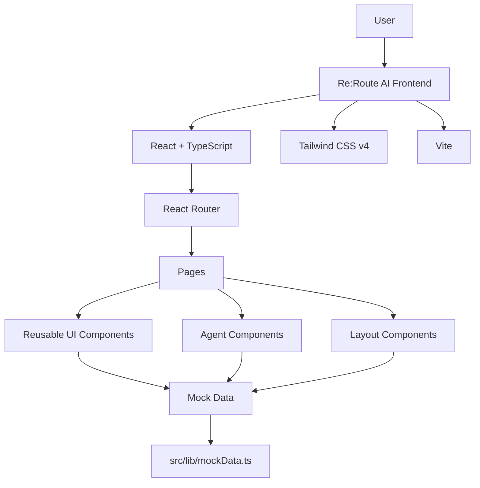

---

# 🧩 Component Architecture

```mermaid
flowchart TD
    A[Re:Route AI]

    A --> B[Pages]
    A --> C[UI Components]
    A --> D[Agent Components]
    A --> E[Layout Components]

    B --> B1[Onboarding]
    B --> B2[Mission Control]
    B --> B3[Schedule]
    B --> B4[Sessions]
    B --> B5[Learning]
    B --> B6[ReRoute]
    B --> B7[Wayfinder]
    B --> B8[Journey]
    B --> B9[Settings]
    B --> B10[Agent Activity]
    B --> B11[Demo]

    C --> C1[Buttons]
    C --> C2[Cards]
    C --> C3[Modals]
    C --> C4[Tabs]
    C --> C5[Search]
    C --> C6[Progress]
    C --> C7[Feedback States]

    D --> D1[Agent Status]
    D --> D2[Agent Activity]
    D --> D3[Agent Explanation]
    D --> D4[Approval Dialog]

    E --> E1[Sidebar]
    E --> E2[Header]
    E --> E3[Mobile Navigation]
```

---

# 🧭 Re:Route AI User Journey

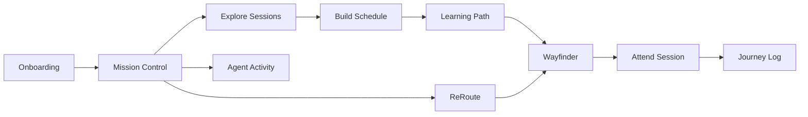

---

# 🤖 AI Agent Experience

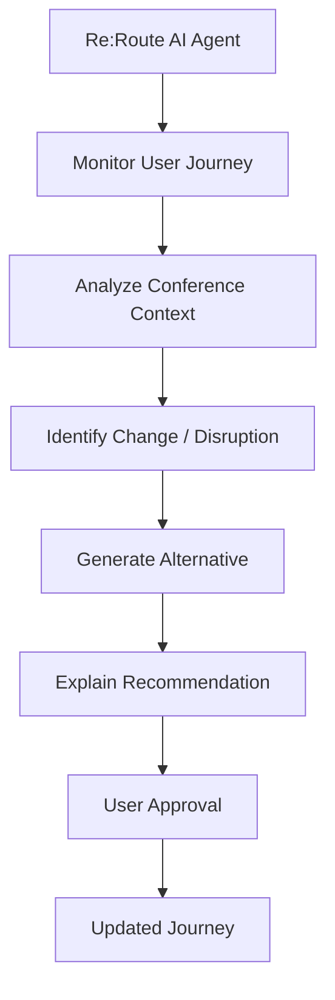

> **Current implementation:** The AI-agent experience is represented through frontend components and mock interaction states. Actual AI-agent processing is not connected yet.

---

# 🗺️ Wayfinder

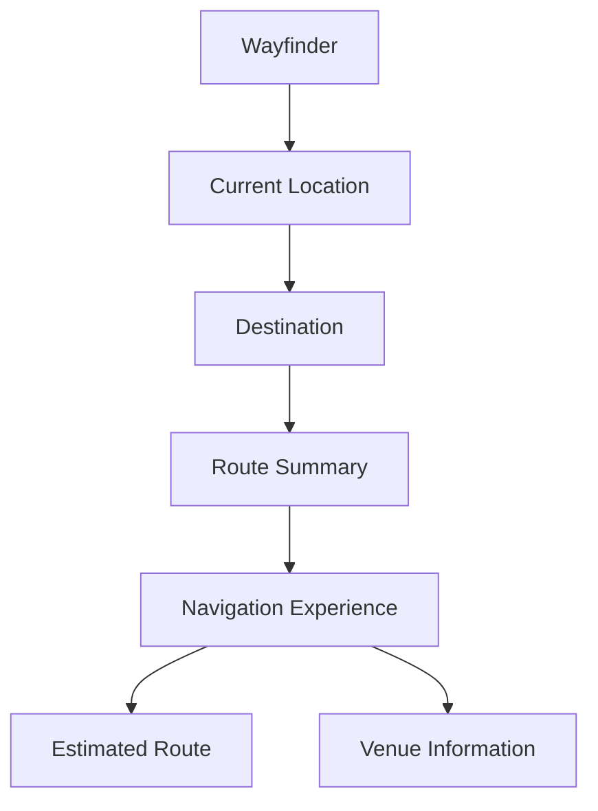

The current Wayfinder page contains a **stylized map placeholder**, not a real maps/GIS integration.

Future integrations could include:

* Mapbox
* Google Maps
* Venue-specific indoor mapping SDK
* Indoor positioning
* Live location tracking
* Floor maps
* Shuttle layers

---

# 🔄 ReRoute Experience

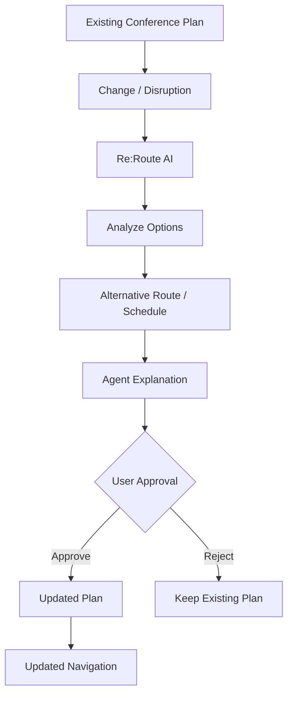

---

# 📅 Session & Schedule Flow

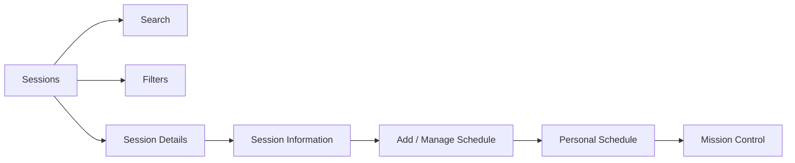

---

# 🛣️ Routes

```text
/onboarding
/mission
/schedule
/sessions
/sessions/:id
/learning
/reroute
/wayfinder
/journey
/settings
/settings/accessibility
/agent/activity
/demo
```

---

# 🗃️ Data Architecture

Re:Route AI is currently a **frontend-only application**.

All application data is mocked in:

```text
src/lib/mockData.ts
```

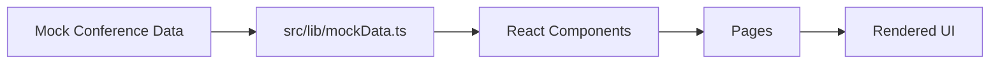

There is currently no backend or database.

---

# 🔮 Future Architecture

The frontend is designed so that the mock-data layer can later be replaced with real services.

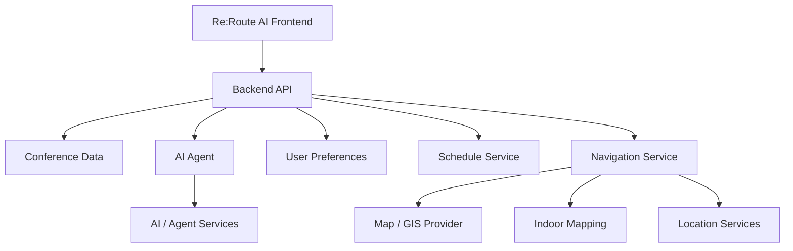

---

# ⚠️ Current Scope

The original requirements document contains **142 sections** covering a very broad feature set.

This implementation focuses on the **P0 core experience and full navigation/component scaffolding** with realistic mock data and interaction states.

### Implemented

* Onboarding
* Mission Control
* Session discovery
* Schedule experience
* Learning experience
* ReRoute interface
* Wayfinder interface
* Journey log
* Settings
* Accessibility
* AI agent activity UI
* Demo mode
* Reusable component library
* Responsive navigation
* Loading, empty, and error states

### Not Yet Integrated

* Real maps/GIS
* Indoor floor maps
* Live location tracking
* Indoor positioning
* Shuttle layers
* Real-time navigation
* Persistent user accounts
* Backend APIs
* Live conference data
* Production AI-agent backend

---

# 🚀 Getting Started

```bash
npm install
npm run dev
```

Then open the local URL printed by Vite.

The application starts at:

```text
/onboarding
```

---

# 🏗️ Build

Create a production build:

```bash
npm run build
```

Preview the production build:

```bash
npm run preview
```

---

# 📂 Project Structure

```text
ReRoute AI/
│
├── src/
│   ├── components/
│   │   ├── ui/
│   │   ├── agent/
│   │   └── layout/
│   │
│   ├── pages/
│   │   ├── Onboarding
│   │   ├── Mission
│   │   ├── Schedule
│   │   ├── Sessions
│   │   ├── Learning
│   │   ├── ReRoute
│   │   ├── Wayfinder
│   │   ├── Journey
│   │   ├── Settings
│   │   ├── Accessibility
│   │   ├── Agent Activity
│   │   └── Demo
│   │
│   ├── lib/
│   │   └── mockData.ts
│   │
│   └── index.css
│
├── package.json
├── tsconfig.json
├── vite.config.*
└── README.md
```

---

# 🎨 Design System

Re:Route AI uses an **AI navigation cockpit** visual direction.

```text
Deep Navy
    +
Signal Orange
    +
AI Navigation Cockpit
    +
Conference Dashboard
```

The primary design system is defined in:

```text
src/index.css
```

---

# 📱 Responsive Design

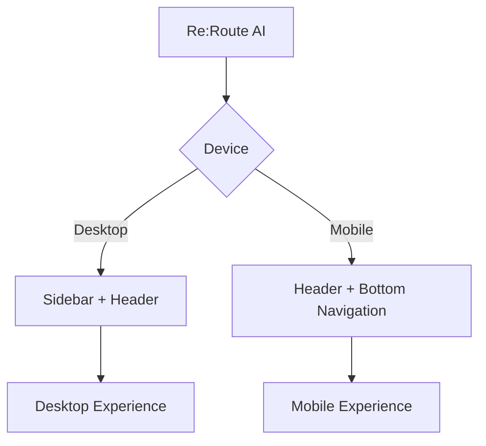

---

# ♿ Accessibility

Accessibility settings are available at:

```text
/settings/accessibility
```

The application includes a dedicated accessibility experience for configuring user-facing accessibility options.

---

# 📌 Project Summary

**Re:Route AI** is a frontend foundation for an AI-powered conference-navigation experience.

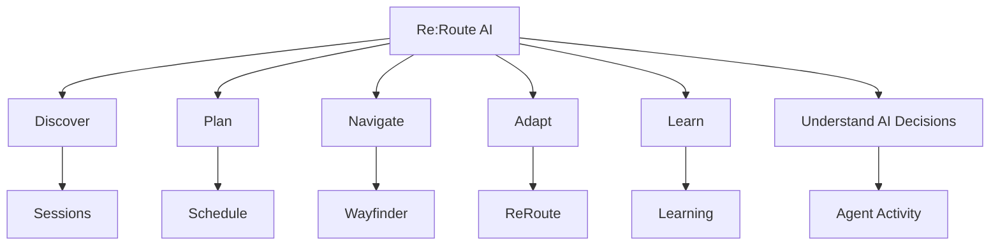

The application is intentionally modular so that **backend APIs, AI agents, mapping services, location tracking, and real-time conference data** can be integrated in future iterations.
